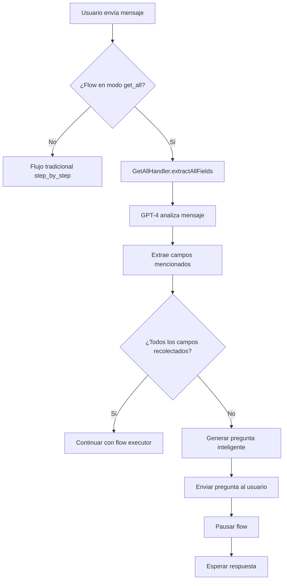
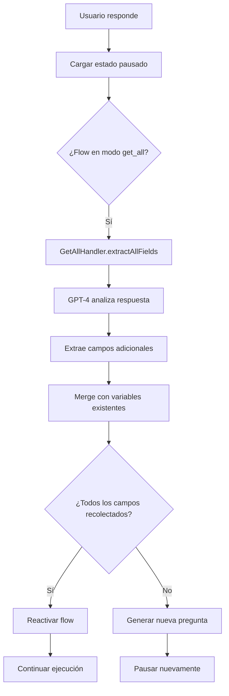

# 🤖 Modo GET ALL - Documentación Técnica

## Descripción General

El **Modo GET ALL** es un enfoque revolucionario para recolectar información del usuario usando Inteligencia Artificial. En lugar de hacer preguntas paso a paso (tradicional), la IA analiza toda la respuesta del usuario y extrae múltiples campos de una vez.

---

## Comparación: Step by Step vs Get All

### 📝 Modo Step by Step (Tradicional)

**Flujo:**
1. Bot: "¿Cómo quieres tu tatuaje?"
2. Usuario: "En mi brazo derecho"
3. Bot: "¿De qué tamaño?"
4. Usuario: "Como de 3cm"
5. Bot: "¿Qué estilo?"
6. Usuario: "Minimalista"
7. ...continúa pregunta por pregunta

**Características:**
- ✅ Estructura predecible
- ✅ Fácil de seguir para usuarios inexpertos
- ❌ Conversación lenta y mecánica
- ❌ Frustrante si el usuario ya mencionó algo

---

### 🤖 Modo Get All (IA Inteligente)

**Flujo:**
1. Bot: "¿Cómo quieres tu tatuaje?"
2. Usuario: "Quiero un tatuaje minimalista en mi brazo derecho de unos 3cm [envía imagen de referencia]"
3. **IA Analiza y Extrae:**
   - estilo: "minimalista"
   - ubicacion: "brazo derecho"
   - tamaño: "3cm"
   - imagenes_referencia: [URL]
4. Bot: "Perfecto! Solo necesito saber: ¿lo quieres a color o en blanco y negro?"

**Características:**
- ✅ Conversación natural y fluida
- ✅ El usuario puede dar varios datos a la vez
- ✅ La IA solo pregunta lo que falta
- ✅ Mucho más rápido
- ⚠️ Requiere OpenRouter API (costo por uso de GPT-4)

---

## Arquitectura Técnica

### Componentes Nuevos

#### 1. `GetAllHandler.ts`
Ubicación: `supabase/functions/smart-flow-engine-v10/core/GetAllHandler.ts`

**Funciones principales:**

```typescript
// Extrae múltiples campos de un mensaje
extractAllFields(
    userMessage: string,
    flow: SmartFlow,
    currentState: FlowState,
    messageImages?: string[]
): Promise<{
    extracted: Record<string, any>;
    missing_fields: string[];
    next_question?: string;
    completion_percentage: number;
}>

// Identifica qué campos debe recolectar el flow
getFieldsToCollect(flow: SmartFlow)

// Llama a GPT-4 para extraer campos del mensaje
callGPT4ForExtraction(...)

// Genera pregunta inteligente para campos faltantes
generateSmartQuestion(...)
```

#### 2. Modificaciones en `index.ts`

**Línea 201-211:** Cargar modo del flow
```typescript
flowDefinition = {
    id: flowData.id.toString(),
    name: flowData.trigger_text,
    trigger_keywords: [flowData.trigger_text],
    mode: flowData.flow_data?.mode || 'step_by_step', // ← NUEVO
    steps: [...],
    variables: {},
    get_all_config: flowData.flow_data?.get_all_config // ← NUEVO
};
```

**Línea 224-295:** Procesar nuevo request en modo get_all
```typescript
if (flowDefinition.mode === 'get_all' && input_text) {
    const getAllHandler = new GetAllHandler();
    const extractionResult = await getAllHandler.extractAllFields(...);

    // Guardar variables extraídas
    state.variables = { ...state.variables, ...extractionResult.extracted };

    // Si falta información, pausar y preguntar
    if (extractionResult.completion_percentage < 100) {
        // Enviar pregunta
        // Pausar flow
        return response;
    }
}
```

**Línea 318-380:** Procesar continuación en modo get_all
```typescript
// Similar a nuevo request pero para mensajes subsecuentes
```

#### 3. Modificaciones en `types.ts`

**Línea 3-4:** Tipo de modo
```typescript
export type FlowMode = 'get_all' | 'step_by_step';
```

**Línea 186:** Modo en SmartFlow
```typescript
export interface SmartFlow {
    id: string;
    name: string;
    trigger_keywords: string[];
    mode?: FlowMode; // ← NUEVO
    steps: AnyFlowStep[];
    variables: Record<string, any>;

    get_all_config?: { // ← NUEVO
        fields_to_collect: string[];
        prompt_template?: string;
    };
}
```

---

## Flujo de Ejecución - Modo Get All

### Escenario: Primer Mensaje del Usuario



### Escenario: Usuario Responde



---

## Ejemplo de Prompt a GPT-4

### Prompt de Extracción

```
Eres un asistente que extrae información de mensajes de clientes para completar formularios.

**CAMPOS YA RECOLECTADOS:**
{
  "estilo": "minimalista",
  "ubicacion": "brazo derecho"
}

**CAMPOS QUE AÚN FALTAN:**
- tamaño: ¿Qué tamaño aproximado? (tipo: text)
- color_o_bn: ¿A color o en blanco y negro? (tipo: text)
- descripcion_personalizada: Describe con tus palabras qué quieres que incluya el diseño (tipo: text)

**MENSAJE DEL CLIENTE:**
"quiero que sea como de 5cm y a color, con una rosa pequeña"

**IMÁGENES ENVIADAS:** 0 imagen(es)

**INSTRUCCIONES:**
1. Analiza el mensaje del cliente
2. Extrae SOLO los campos que el cliente mencionó (de la lista de campos faltantes)
3. NO inventes información que no esté en el mensaje
4. Devuelve un JSON con los campos extraídos

**FORMATO DE RESPUESTA (JSON):**
{
  "campo_variable": "valor_extraído",
  "otro_campo": "otro_valor"
}

Responde SOLO con el JSON, sin texto adicional.
```

### Respuesta de GPT-4

```json
{
  "tamaño": "5cm",
  "color_o_bn": "a color",
  "descripcion_personalizada": "rosa pequeña"
}
```

### Prompt de Generación de Pregunta

```
Genera una pregunta natural y amigable en español que pida los siguientes datos al cliente:

- ¿Es tu primer tatuaje?
- ¿Quieres agendar una consulta?

**CONTEXTO:**
Ya recolectamos: estilo, ubicacion, tamaño, color_o_bn, descripcion_personalizada

**INSTRUCCIONES:**
1. Pregunta debe ser natural y conversacional
2. Puede pedir varios datos en una sola pregunta si son relacionados
3. Ser específica y clara
4. Máximo 2-3 líneas
5. Sin emojis excesivos (máximo 1-2)

Responde SOLO con la pregunta, sin texto adicional.
```

### Respuesta de GPT-4

```
Perfecto! Me gusta la idea de la rosa. Una última cosa: ¿es tu primer tatuaje? Y si quieres, podemos agendar una consulta presencial para mostrarte algunos diseños similares 😊
```

---

## Configuración en Frontend (flow-builder-v3.js)

### Toggle de Modo

```javascript
// En renderBasicSettingsV3()
<div class="grid grid-cols-2 gap-3">
    <button onclick="window.setFlowMode('step_by_step')" ...>
        📝 Paso a Paso
    </button>
    <button onclick="window.setFlowMode('get_all')" ...>
        🤖 Get All (IA)
    </button>
</div>
```

### Guardar con Modo

```javascript
// En window.saveFlowV3()
const flowData = {
    id: currentFlow.id || `flow_${Date.now()}`,
    mode: currentFlow.mode || 'step_by_step', // ← Incluye el modo
    trigger_keywords: currentFlow.triggerKeywords,
    recommended_products: currentFlow.recommended_products,
    steps: [...],
    variables: {}
};
```

---

## Estructura de Datos

### Flow en Supabase (auto_responses.flow_data)

```json
{
  "id": "flow_tatuaje_personalizado",
  "mode": "get_all",
  "trigger_keywords": ["tatuaje", "tattoo", "cotizar tatuaje"],
  "recommended_products": [12, 34],
  "steps": [
    {
      "id": "step_1",
      "type": "question",
      "content": "¿Qué estilo prefieres?",
      "variable": "estilo",
      "next_step": "step_2"
    },
    {
      "id": "step_2",
      "type": "question",
      "content": "¿En qué parte del cuerpo?",
      "variable": "ubicacion",
      "next_step": "step_3"
    }
  ],
  "get_all_config": {
    "fields_to_collect": ["estilo", "ubicacion", "tamaño", "color_o_bn"]
  }
}
```

### Estado del Flow (flow_states)

```json
{
  "flow_id": "123",
  "current_step_id": "step_1",
  "status": "paused",
  "variables": {
    "estilo": "minimalista",
    "ubicacion": "brazo derecho",
    "tamaño": "3cm",
    "imagenes_referencia": ["https://..."]
  },
  "metadata": {
    "completion_percentage": 75,
    "missing_fields": ["color_o_bn", "primer_tatuaje"]
  }
}
```

---

## Costos y Performance

### Costos de OpenRouter

Cada extracción de campos usa aproximadamente:
- **Modelo**: `openai/gpt-4o-mini`
- **Tokens promedio**: ~800 tokens (prompt + respuesta)
- **Costo por extracción**: ~$0.0001 - $0.0002 USD
- **Costo mensual** (100 conversaciones/día): ~$0.60 - $1.20 USD

### Performance

- **Tiempo de respuesta**: 1-3 segundos (llamada a GPT-4)
- **Reducción de mensajes**: 40-60% vs modo step_by_step
- **Satisfacción del usuario**: ↑↑↑ (conversación más natural)

---

## Mejores Prácticas

### ✅ Cuándo usar Get All

- **Procesos complejos** con muchos campos (5+)
- **Usuarios avanzados** que dan información completa
- **Conversaciones naturales** tipo consultoría (tatuajes, diseño, eventos)
- **Formularios largos** donde el usuario puede escribir todo de una vez

### ❌ Cuándo NO usar Get All

- **Procesos simples** (1-3 campos)
- **Campos binarios** (sí/no, A o B)
- **Usuarios inexpertos** que necesitan guía estructurada
- **Formularios críticos** donde precisión es más importante que velocidad

---

## Debugging

### Logs Importantes

```typescript
// En consola de Supabase Edge Functions
[SmartFlowEngine] Flow mode: get_all
[GetAllHandler] Analyzing message with GPT-4 for multi-field extraction
[GetAllHandler] Fields to collect: [...]
[GetAllHandler] Already collected: [...]
[GetAllHandler] GPT-4 extracted: {...}
[SmartFlowEngine] GET_ALL: 75% complete. Asking for missing fields...
```

### Respuesta de API

```json
{
  "status": "GET_ALL_WAITING",
  "completion_percentage": 75,
  "missing_fields": ["color_o_bn", "primer_tatuaje"],
  "question_sent": "Perfecto! Solo necesito saber: ¿lo quieres a color o en blanco y negro? Y ¿es tu primer tatuaje?"
}
```

---

## Próximas Mejoras

1. **Cache de extracciones** - Evitar re-procesar mismo mensaje
2. **Extracción de imágenes mejorada** - Usar Vision API para analizar contenido
3. **Validación en tiempo real** - GPT-4 valida campos extraídos
4. **Sugerencias inteligentes** - IA sugiere valores basados en contexto
5. **Multi-idioma** - Soporte para inglés, portugués, etc.

---

## Soporte y Contacto

Para reportar bugs o sugerir mejoras:
- **GitHub**: Issues en repositorio principal
- **Email**: soporte@flowz.app
- **Documentación**: [FLOWZ-DOCS.md](./FLOWZ-DOCS.md)

---

**Última actualización**: 2026-02-14
**Versión**: 1.0.0
**Estado**: ✅ Producción
